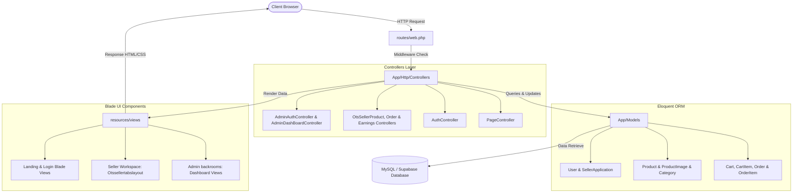

# 🛍️ Multi-Vendor E-Commerce System

[](https://laravel.com)
[](https://php.net)
[](https://getbootstrap.com)
[](https://mysql.com)

A robust, full-stack multi-vendor marketplace web application built using **Laravel** and **Bootstrap**. The system provides a structured platform allowing **Admins**, **Sellers**, and **Buyers** to interact seamlessly with role-based access control, product listing CRUDs, automated multi-vendor cart & checkout splitting, and comprehensive order tracking.

---

## 📖 Table of Contents
1. [Project Overview](#-project-overview)
2. [Key Features](#-key-features)
3. [Tech Stack](#-tech-stack)
4. [System Architecture](#-system-architecture)
5. [Project Structure](#-project-structure)
6. [Installation Guide](#-installation-guide)
7. [Usage & User Workflows](#-usage--user-workflows)
8. [Team & Contributions](#-team--contributions)
9. [Development Roadmap & Progress](#-development-roadmap--progress)
10. [Future Improvements](#-future-improvements)
11. [Screenshots & Demo](#-screenshots--demo)
12. [License](#-license)

---

## 🌟 Project Overview

This multi-vendor platform is tailored to handle the complexities of a marketplace where multiple sellers list products, and buyers purchase from different vendors in a single checkout sequence. Behind the scenes, the system handles order routing, seller balance calculation, and administrative verification.

### Key Workflows
* **Sellers** request verification to list products.
* **Admins** operate behind the scenes via a secured admin portal (the `backrooms`) to review applications, approve products, and manage users.
* **Buyers** browse items, add them to a dynamic cart, and purchase. Orders are automatically split by seller to ensure clean fulfillment pipelines.

---

## 🚀 Key Features

* **🔒 Secure Authentication:** Implemented via Laravel-based authentication (`AuthController`), separating standard users from backroom administrators.
* **👥 Multi-Role Ecosystem:** Distinguishes between Buyers, Sellers, and Admins with distinct middleware rules and session controls.
* **📦 Product Management Suite:** Complete CRUD operations for sellers with image uploading, categories, and inventory metrics.
* **🛒 Smart Cart & Split Checkout:** Multi-vendor order splitting splits items from different sellers into individual sub-orders for isolated status updates and shipping.
* **📊 Seller Earnings & Payouts:** Ledger system tracking balance sheets and payout mechanics for vendor withdrawals.
* **🛡️ Admin Backrooms Approval System:** A dedicated dashboard for administrators to review seller applications, approve/reject products, and manage accounts.
* **🎨 Responsive UI:** Clean, modern interface designed with custom Bootstrap components, alerts, and modular blade layouts.

---

## 💻 Tech Stack

* **Backend Framework:** Laravel (PHP 8.2+)
* **Frontend UI:** Blade Templates + Bootstrap 5.3 + Vite (Asset bundling)
* **Database:** MySQL / Supabase (Cloud SQL hosting)
* **Session & Middleware:** Laravel Native Middleware & Authentication
* **Version Control:** Git & GitHub

---

## 🏗️ System Architecture

The application implements a clean **Model-View-Controller (MVC)** architectural pattern using Laravel's core conventions.



---

## 📂 Project Structure

Below is an overview of the key directories and implementation files making up the core application logic:

```bash
Pet-E-commerce-main/
├── app/
│   ├── Http/
│   │   └── Controllers/
│   │       ├── AdminAuthController.php          # Admin authentication logic
│   │       ├── AdminDashBoardController.php     # Admin panel features (approvals, role updates)
│   │       ├── AuthController.php               # Buyer/Seller signup, login, and sessions
│   │       ├── OtsSellerEarningsController.php  # Ledger & withdrawal calculations for vendors
│   │       ├── OtsSellerOrderController.php     # Order status updates (Pending -> Dispatched)
│   │       ├── OtsSellerProductController.php   # Inventory CRUD and stock updates
│   │       └── PageController.php               # Landing page & navigation handler
│   └── Models/
│       ├── User.php                             # Unified user credentials & roles
│       ├── SellerApplication.php                # Application records waiting for Admin sign-off
│       ├── Product.php & ProductImage.php       # Product attributes, stock, and media mappings
│       ├── Category.php                         # Product organization categories
│       ├── Cart.php & CartItem.php              # In-memory checkout pre-processing
│       └── Order.php & OrderItem.php            # Splittable checkout models
├── resources/
│   └── views/
│       ├── admin/                               # Admin template layouts and dashboard cards
│       ├── common/                              # Reusable navbars, footers, and error alerts
│       ├── Otssellertabslayout.blade.php        # Core base template for Seller dashboards
│       ├── Otssellerproductstab.blade.php      # Sellers inventory management panel
│       ├── Otssellerorderstab.blade.php        # Orders control center for vendors
│       ├── Otssellerearningstab.blade.php       # Ledger records & withdrawal forms
│       ├── landing.blade.php                    # Public facing marketplace layout
│       └── login.blade.php                      # Unified login/register blade
├── routes/
│   └── web.php                                  # Main application routing & middleware groups
└── database/
    ├── migrations/                              # Database schema definition files
    └── seeders/                                 # Initial data generation
```

---

## 🛠️ Installation Guide

Follow these steps to set up and run the project locally.

### Prerequisites
* **PHP** (>= 8.2)
* **Composer**
* **Node.js & NPM**
* **MySQL** database server (or Supabase URL connection)

### Steps

1. **Clone the Repository:**
   ```bash
   git clone https://github.com/your-username/pet-e-commerce.git
   cd pet-e-commerce
   ```

2. **Install Dependencies:**
   * Install Composer (PHP) dependencies:
     ```bash
     composer install
     ```
   * Install NPM (Frontend) dependencies:
     ```bash
     npm install
     ```

3. **Configure Environment File:**
   * Copy the `.env.example` file to `.env`:
     ```bash
     cp .env.example .env
     ```
   * Open `.env` and set up your database connection configurations:
     ```env
     DB_CONNECTION=mysql
     DB_HOST=127.0.0.1
     DB_PORT=3306
     DB_DATABASE=your_database_name
     DB_USERNAME=your_username
     DB_PASSWORD=your_password
     ```

4. **Generate Application Key:**
   ```bash
   php artisan key:generate
   ```

5. **Run Migrations & Seeders:**
   * Run the database migrations to set up tables:
     ```bash
     php artisan migrate --seed
     ```

6. **Compile Frontend Assets:**
   * Compile CSS/JS files using Vite:
     ```bash
     npm run dev
     ```

7. **Start the Local Server:**
   * Run the PHP development server:
     ```bash
     php artisan serve
     ```
   * The application will now be available at `http://127.0.0.1:8000`.

---

## 💡 Usage & User Workflows

### 🛒 1. Buyers
* **Landing Page:** Browse verified products. Filter by category or search.
* **Cart Operations:** Add products from different sellers.
* **Checkout:** Order placement triggers order-splitting algorithms to isolate vendor shipping logs.

### 🏪 2. Sellers
* **Application:** Fill out the vendor application form on registration.
* **Inventory Panel:** Navigate to `/seller/products` to create, read, update, or delete products.
* **Fulfillment:** Monitor orders at `/seller/orders`, marking items as shipped or processing.
* **Earnings:** Access `/seller/earnings` to view completed sales, review fees, and request payouts.

### 🛡️ 3. Admins (Backroom Portal)
* **Login URL:** Access the hidden admin gateway at `/backrooms/login`.
* **Approvals:** Approve or reject newly registered sellers and review submitted product listings before they go live on the landing page.
* **Moderation:** Edit user roles, suspend malicious accounts, and manage categories.

---

## 👥 Team & Contributions

This project was built by a dedicated team focusing on specific aspects of the Laravel/Bootstrap architecture:

* **Backend Lead - John Karl Espanol:** Architectural setup, database schemas, Eloquent relationship definition, and API controllers.
* **Frontend Lead - Carlos Jimenez:** User Experience, Blade templating engines, layout scaffolding, and Bootstrap 5.3 styling.
* **Full Stack Developer - Franz Jearson De Limios:** Cart-to-checkout pipelines, order-splitting modules, and validation hooks.
* **UI/UX Designer & Project Manager - Yhasmen Nogales:** Version control compliance (Git branching), testing frameworks, product seed documentation, demo logic, high-fidelity UI mockups, interface consistency guidelines, layout designs, and interactive user flows.

---

## 📈 Development Roadmap & Progress

| Module | Feature | Status |
| :--- | :--- | :---: |
| **1** | System Setup & Core Laravel Architecture |  |
| **2** | Authentication System & Role Middleware |  |
| **3** | Product Management CRUD (Seller Dashboard) |  |
| **4** | Cart & Splitting Checkout Pipeline |  |
| **5** | Order Tracking System (Seller & Buyer Statuses) |  |
| **6** | Admin Dashboard & Approval System (Backrooms) |  |
| **7** | UI/UX Finalization & Responsive Design polish |  |
| **8** | End-to-End Testing & Database Integration |  |
| **9** | Demo Preparation & Seeding Mock Data |  |

---

## 🔮 Future Improvements

* **💳 Payment Gateway Integration:** Add secure checkout payments using Stripe or PayPal.
* **💬 Real-Time Messaging:** Enable direct buyer-to-seller chats for product inquiries.
* **💬 Product Reviews & Comments:** Add a dedicated reviews/comments section for buyers to leave feedback on products they have purchased.
* **🐶 Pet Adoption Portal:** Introduce a structured adoption board where shelters can list adoptable pets and users can submit adoption inquiries.
* **📈 Analytics Dashboards:** Provide sellers with visual graphs detailing monthly revenue, popular items, and customer retention.
* **📱 Mobile App Wrapper:** Convert the Bootstrap layout into a native feel via Capacitor or PWA setup.

---

## 📸 Screenshots & Demo

*(Optional: Add your custom dashboard and storefront images here to highlight the responsive frontend interface)*

| Customer Storefront | Seller Dashboard | Admin Panel |
| :---: | :---: | :---: |
|  |  |  |

---

## 📄 License

This project is licensed under the [MIT License](LICENSE) - see the LICENSE file for details.
